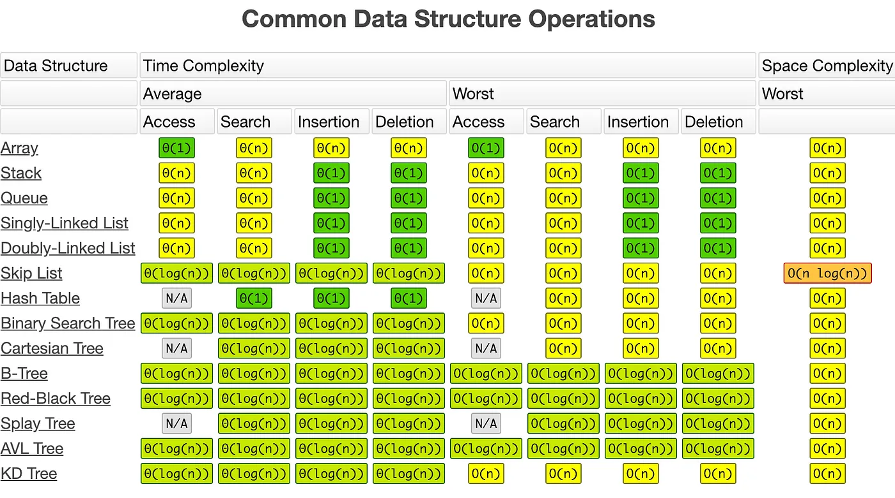

## Array

- **Definition**: A collection of elements, each identified by an array index or key.
- Characteristics:
  - Fixed size: You must define the size of the array when you create it.
  - Indexed access: Allows for constant time (O(1)) access to elements by index.
- Advantages:
  - Simple and easy to use.
  - Efficient for accessing elements by index.
- Disadvantages:
  - Fixed size can lead to wasted memory or overflow.
  - Inserting or deleting elements can be costly (O(n)) as it may require shifting elements.

## Linked List

- **Definition**: A linear collection of data elements, where each element points to the next. It can be singly linked (one direction) or doubly linked (two directions).
- Characteristics:
  - Dynamic size: Can grow or shrink as needed.
  - Nodes contain data and a reference to the next node (and possibly the previous node in a doubly linked list).
- Advantages:
  - Dynamic size allows efficient use of memory.
  - Easier to insert or delete elements (O(1) if the position is known).
- Disadvantages:
  - No indexed access; need to traverse the list to access an element (O(n)).
  - Additional memory overhead due to storage of pointers.

## Binary Tree

- **Definition**: A hierarchical structure in which each node has at most two children, referred to as the left child and the right child.
- Characteristics:
  - Each node contains a value, a reference to the left child, and a reference to the right child.
- Advantages:
  - Can be used to implement efficient search algorithms (binary search tree).
  - Can represent hierarchical data.
- Disadvantages:
  - Can become unbalanced, leading to inefficient operations.
  - Balancing the tree (like in AVL trees or Red-Black trees) can be complex.

## Heap

- **Definition**: A special tree-based data structure that satisfies the heap property. In a max-heap, for any given node, the value of that node is greater than or equal to the values of its children. In a min-heap, the value of that node is less than or equal to the values of its children.
- Characteristics:
  - Used to implement priority queues.
  - Can be efficiently implemented as an array.
- Advantages:
  - Efficiently supports priority queue operations like insertion and extraction of the maximum/minimum element (O(log n)).
- Disadvantages:
  - Not efficient for searching for arbitrary elements (O(n)).

## Hashtable

- **Definition**: A data structure that implements an associative array, a structure that can map keys to values.
- Characteristics:
  - Uses a hash function to compute an index into an array of buckets or slots.
- Advantages:
  - Provides average-case constant time (O(1)) complexity for lookups, insertions, and deletions.
- Disadvantages:
  - Poor performance in the worst case if too many elements hash to the same index.
  - Requires a good hash function to minimize collisions.

## Graph

- **Definition**: A collection of nodes (or vertices) and edges (or arcs) that connect pairs of nodes.
- Characteristics:
  - Can be directed or undirected.
  - Can be weighted (edges have weights) or unweighted.
- Advantages:
  - Flexible representation of various structures like social networks, maps, etc.
- Disadvantages:
  - Complex algorithms may be required for operations like traversal, shortest path, etc.

## Time and Space Complexities

| Data Structure  | Operation        | Best Time Complexity | Average Time Complexity | Worst Time Complexity | Space Complexity |
| --------------- | ---------------- | -------------------- | ----------------------- | --------------------- | ---------------- |
| **Array**       | Access           | O(1)                 | O(1)                    | O(1)                  | O(n)             |
|                 | Search           | O(1)                 | O(n)                    | O(n)                  |                  |
|                 | Insertion        | O(1)                 | O(n)                    | O(n)                  |                  |
|                 | Deletion         | O(1)                 | O(n)                    | O(n)                  |                  |
| **Linked List** | Access           | O(1)                 | O(n)                    | O(n)                  | O(n)             |
|                 | Search           | O(1)                 | O(n)                    | O(n)                  |                  |
|                 | Insertion        | O(1)                 | O(1)                    | O(1)                  |                  |
|                 | Deletion         | O(1)                 | O(1)                    | O(1)                  |                  |
| **Binary Tree** | Access           | O(log n)             | O(log n)                | O(n)                  | O(n)             |
| (Balanced)      | Search           | O(log n)             | O(log n)                | O(n)                  |                  |
|                 | Insertion        | O(log n)             | O(log n)                | O(n)                  |                  |
|                 | Deletion         | O(log n)             | O(log n)                | O(n)                  |                  |
| **Heap**        | Access (max/min) | O(1)                 | O(1)                    | O(1)                  | O(n)             |
|                 | Insertion        | O(1)                 | O(log n)                | O(log n)              |                  |
|                 | Deletion         | O(log n)             | O(log n)                | O(log n)              |                  |
|                 | Search           | O(n)                 | O(n)                    | O(n)                  |                  |
| **Hashtable**   | Access           | O(1)                 | O(1)                    | O(n)                  | O(n)             |
|                 | Search           | O(1)                 | O(1)                    | O(n)                  |                  |
|                 | Insertion        | O(1)                 | O(1)                    | O(n)                  |                  |
|                 | Deletion         | O(1)                 | O(1)                    | O(n)                  |                  |
| **Graph**       | DFS Traversal    | O(V + E)             | O(V + E)                | O(V + E)              | O(V + E) (list)  |
|                 | BFS Traversal    | O(V + E)             | O(V + E)                | O(V + E)              | O(V^2) (matrix)  |
|                 | Add Vertex       | O(1)                 | O(1) (list)             | O(V^2) (matrix)       |                  |
|                 | Add Edge         | O(1)                 | O(1) (list)             | O(1) (matrix)         |                  |
|                 | Remove Vertex    | O(V + E)             | O(V + E) (list)         | O(V^2) (matrix)       |                  |
|                 | Remove Edge      | O(1)                 | O(E) (list)             | O(1) (matrix)         |                  |
|                 | Check for Edge   | O(1)                 | O(V) (list)             | O(1) (matrix)         |                  |
|                 | Iterate Edges    | O(E)                 | O(V + E) (list)         | O(V^2) (matrix)       |                  |

