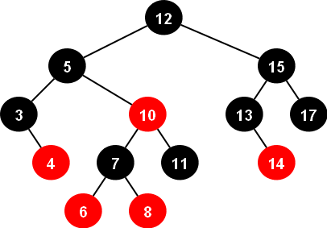
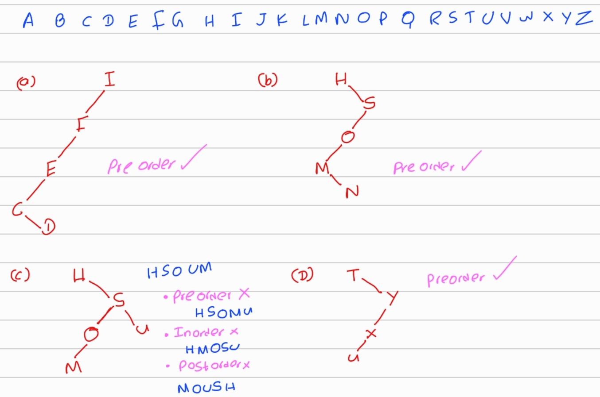
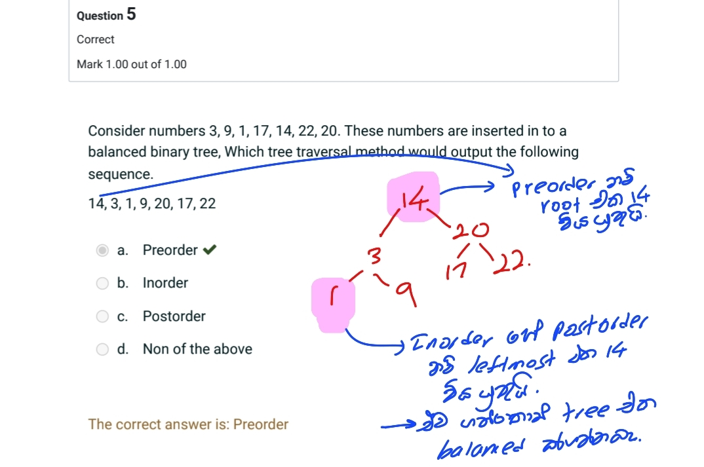

# Trees

A tree is a hierarchical data structure consisting of nodes connected by edges. The top node is called the root, and each node can have zero or more child nodes. Nodes with no children are called leaf nodes.


#### Tree Terminology:

- **Root**: The topmost node in a tree.
- **Node**: A fundamental part of a tree, which can have children.
- **Edge**: The connection between two nodes.
- **Parent**: A node directly connected to another node when moving towards the root.
- **Child**: A node directly connected to another node when moving away from the root.
- **Leaf**: A node with no children.
- **Height**: The length of the longest path from the node to a leaf.

```markdown
Height of a tree -> number of edges wage.

Empty Tree:
height = -1 (or 0)

Tree with One Node:
  1
height = 0

Balanced Binary Tree:
    1
   / \
  2   3
 / \   \
4   5   6
Here, the height is 2 (path from root 1 -> 2 -> 4 or root 1 -> 3 -> 6).

Unbalanced Binary Tree:
  1
   \
    2
     \
      3
       \
        4
Here, the height is 3 (path from root 1 -> 2 -> 3 -> 4).
```
- **Depth**: The length of the path from the root to the node.
- **Subtree**: A tree formed by a node and all its descendants.

#### Relationships:

- For a tree with `n` nodes, there are always `n-1` edges.
- The minimum number of edges in a tree with `n` nodes is `n-1` (a linked list).

------

### Binary Tree

- **Definition**: Each node has at most two children.
- **Node Structure**: Contains a value and pointers to left and right children.
- **Ordering**: No specific ordering rules.
- **Use Cases**: General hierarchical data representation.

### Binary Search Tree (BST)

- **Definition**: Nodes are ordered such that left subtree < current node < right subtree.
- **Node Structure**: Same as binary tree.
- **Search Efficiency**: Designed for efficient searching, insertion, and deletion (O(log n) on average).
- **Use Cases**: `Efficient searching, especially when data is frequently inserted or deleted.`

------

# Binary Search Trees (BSTs)

A binary search tree is a specific type of binary tree in which the nodes are ordered in a particular way. For each node:

- All nodes in the left subtree have values less than the node's value.
- All nodes in the right subtree have values greater than the node's value.

#### Operations on BSTs:

O(h) = o(log n) ,  h < - height of the tree

| Operation | Description                                                  | Average Case Complexity | Worst Case Complexity |
| --------- | ------------------------------------------------------------ | ----------------------- | --------------------- |
| Search    | Start at the root and recursively search left or right based on the value being searched for. | O(log n)                | O(n)                  |
| Insertion | Similar to search, but if the value is not found, a new node is added in the appropriate location. | O(log n)                | O(n)                  |
| Deletion  | If the node to be deleted has no children, it is simply removed. If it has one child, the child replaces the node. If it has two children, a successor node is chosen and the tree is reorganized. | O(log n)                | O(n)                  |
| Traversal | Three common ways to traverse a BST are inorder (left-root-right), preorder (root-left-right), and postorder (left-right-root). | O(n) for each           | O(n) for each         |

[^Worst case occurs when Binary search Tree becomes a LinkedList]: _

Relationships:

- For a binary search tree with `n` nodes, there can be at most `n-1` edges in the tree (each node except the root has exactly one incoming edge).
- <mark>The number of edges in a binary search tree is always equal to the number of nodes minus one (`n-1`).</mark>
- ***The Catalan number** gives the <u>total number of possible binary search trees</u> with n different keys*
  $$
  NumberOfBST's :  C_n = \frac{1}{n+1} \binom{2n}{n} = \frac{(2n)!}{(n+1)!n!}
  $$
  
  - **Total number of possible Binary Trees (BTs) with n different keys:**
  
    Each BST can be rearranged in n!n!n! different ways to form different binary trees (since each BST structure can have the keys arranged in any order). Therefore, the total number of possible binary trees with n distinct keys is:
    $$
    countBT(n)=countBST(n)×n!
    $$
  
    $$
    NumberOfBT's :  C_n = \frac{(2n)!}{(n+1)!}
    $$
  
    

```c++
#include <iostream>
using namespace std;

struct Node {
    int key;
    Node* left;
    Node* right;

    Node(int data) {
        key = data;
        left = nullptr;
        right = nullptr;
    }
};

class BST {
private:
    Node* root;

    Node* search(Node* root, int key) {
        if (root == nullptr || root->key == key)
            return root;
        if (key < root->key)
            return search(root->left, key);
        return search(root->right, key);
    }

    Node* insert(Node* root, int key) {
        if (root == nullptr)
            return new Node(key);
        if (key < root->key)
            root->left = insert(root->left, key);
        else if (key > root->key)
            root->right = insert(root->right, key);
        return root;
    }

    Node* minValueNode(Node* node) {
        Node* current = node;
        while (current && current->left != nullptr)
            current = current->left;
        return current;
    }

    Node* deleteNode(Node* root, int key) {
        if (root == nullptr)
            return root;
        if (key < root->key)
            root->left = deleteNode(root->left, key);
        else if (key > root->key)
            root->right = deleteNode(root->right, key);
        else {
            if (root->left == nullptr) {
                Node* temp = root->right;
                delete root;
                return temp;
            }
            else if (root->right == nullptr) {
                Node* temp = root->left;
                delete root;
                return temp;
            }
            Node* temp = minValueNode(root->right);
            root->key = temp->key;
            root->right = deleteNode(root->right, temp->key);
        }
        return root;
    }

    void inorder(Node* root) {
        if (root == nullptr)
            return;
        inorder(root->left);
        cout << root->key << " ";
        inorder(root->right);
    }

    void preorder(Node* root) {
        if (root == nullptr)
            return;
        cout << root->key << " ";
        preorder(root->left);
        preorder(root->right);
    }

    void postorder(Node* root) {
        if (root == nullptr)
            return;
        postorder(root->left);
        postorder(root->right);
        cout << root->key << " ";
    }

public:
    BST() {
        root = nullptr;
    }

    void insert(int key) {
        root = insert(root, key);
    }

    void remove(int key) {
        root = deleteNode(root, key);
    }

    bool search(int key) {
        return search(root, key) != nullptr;
    }

    void inorderTraversal() {
        inorder(root);
        cout << endl;
    }

    void preorderTraversal() {
        preorder(root);
        cout << endl;
    }

    void postorderTraversal() {
        postorder(root);
        cout << endl;
    }
};

int main() {
    BST bst;
    bst.insert(8);
    bst.insert(3);
    bst.insert(10);
    bst.insert(1);
    bst.insert(6);
    bst.insert(14);
    bst.insert(4);
    bst.insert(7);
    bst.insert(13);

    cout << "Inorder traversal:" << endl;
    bst.inorderTraversal();

    cout << "Preorder traversal:" << endl;
    bst.preorderTraversal();

    cout << "Postorder traversal:" << endl;
    bst.postorderTraversal();

    cout << "Search for 6: " << (bst.search(6) ? "Found" : "Not found") << endl;
    cout << "Search for 11: " << (bst.search(11) ? "Found" : "Not found") << endl;

    bst.remove(3);
    cout << "After deleting 3:" << endl;
    cout << "Inorder traversal:" << endl;
    bst.inorderTraversal();

    return 0;
}

```

------

# k-ary Tree

A **k-ary tree** is a generalization of a binary tree where each node can have up to \( k \) children. This is not same as General trees.

- **General Tree**: A node can have any number of children.
- **k-ary Tree**: A node can have at most k children.

## Key Characteristics

1. **Node Degree**: Each node can have at most \( k \) children.
2. **Levels**: The level of a node is its distance from the root.
3. **Height**: Number of edges on the longest path from the root to a leaf.
4. **Full k-ary Tree**: Every node has either 0 or \( k \) children.
5. **Complete k-ary Tree**: All levels, except possibly the last, are fully fill
6. ed, and all nodes are as far left as possible.

## Examples

- **Binary Tree**: 2-ary tree where each node can have up to 2 children.
- **Ternary Tree**: 3-ary tree where each node can have up to 3 children.
- **Quaternary Tree**: 4-ary tree where each node can have up to 4 children.

## Properties

1. **Number of Nodes**: A k-ary tree with height \( h \) has at most  
   $$
   \frac{k^{h+1} - 1}{k - 1}    nodes.
   $$
2. **Number of Leaves**: In a full k-ary tree with \( n \) internal nodes, there are \( kn + 1 \) nodes.
3. Nodes at depth d = k<sup>d</sup>

## Red Black Trees



A Red-Black Tree is a type of self-balancing binary search tree (BST) where each node has an extra bit called the color, which is either red or black. These colors are used to ensure that the tree remains balanced during insertions and deletions.

### Properties of Red-Black Trees:

1. **Node Coloring**: Each node is colored either red or black.
2. **Root Property**: The root is always black.
3. **Red Node Property**: Red nodes cannot have red children. In other words, a red node can only have black children.
4. **Black Height Property**: All paths from a node to its leaves must have the same number of black nodes. This property ensures that the tree remains balanced.

### Operations on Red-Black Trees:

1. **Insertion**: After inserting a node, the tree is reorganized and recolored if necessary to maintain the properties.
2. **Deletion**: After deleting a node, the tree is reorganized and recolored if necessary to maintain the properties.

   
3. **Search**: Same as in a regular binary search tree.

### Advantages of Red-Black Trees:

- **Balanced Structure**: Red-Black Trees guarantee that the tree remains balanced, ensuring `O(log n)` time complexity ` for insertion, deletion, and search operations.`
- **Efficient Operations**: Compared to AVL trees (another type of balanced BST), Red-Black Trees have a slightly simpler balancing algorithm, making them easier to implement and potentially more efficient for some operations.

### Disadvantages of Red-Black Trees:

- **Complexity**: While simpler than AVL trees, Red-Black Trees still require careful implementation to ensure the properties are maintained.
- **Suboptimal Balance**: Red-Black Trees may not be as strictly balanced as AVL trees, which can lead to slightly longer search times in some cases.

Overall, Red-Black Trees are a popular choice for implementing balanced binary search trees due to their balance guarantees and relatively simple balancing rules.

------

# Questions




InOrder and PostOrder Both starts at leftmost Node.

