# Direct Access Table


### Overview

A Direct Access Table (DAT) is a simple and efficient data structure that allows constant time complexity for search, insertion, and deletion operations. It is ideal for scenarios where the universe of keys is small and all possible keys are known in advance.

### Structure

A Direct Access Table is essentially an array where each position corresponds directly to a key. The position in the array is calculated directly from the key itself, making operations very fast.

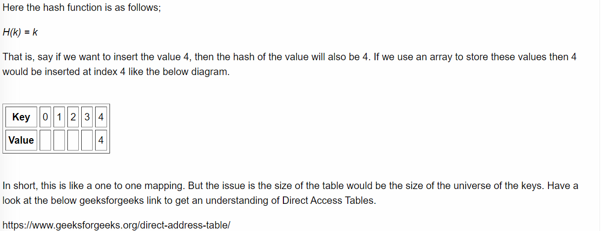

#### Example

Here's a simple example in C++:

```c++
#include <iostream>
#include <vector>

int main() {
    // Suppose we have a small range of keys from 0 to 9
    const int SIZE = 10;
    std::vector<int> dat(SIZE, -1); // Initialize the table with -1 indicating empty slots

    // Insert values
    dat[2] = 2;
    dat[5] = 5;
    dat[9] = 9;

    // Access values
    std::cout << "Value at key 2: " << dat[2] << std::endl;
    std::cout << "Value at key 5: " << dat[5] << std::endl;

    // Delete a value
    dat[2] = -1;

    // Check if a key is present
    if (dat[2] != -1) {
        std::cout << "Key 2 is present with value: " << dat[2] << std::endl;
    } else {
        std::cout << "Key 2 is not present." << std::endl;
    }

    return 0;
}

```

#### Advantages

- **Constant Time Complexity (O(1))**: Operations like search, insertion, and deletion are performed in constant time.
- **Simplicity**: Easy to implement and understand.

#### Disadvantages

- **Memory Inefficiency**: Not suitable for large or sparsely populated key spaces due to high memory consumption.
- **Limited Applicability**: Only practical for small and well-defined sets of keys.

# Hash Table

### Overview

A hash table (or hash map) is a data structure that provides efficient insertion, deletion, and lookup of key-value pairs by using a hash function to map keys to indices in an array of buckets. C++ offers a built-in hash table implementation called `unordered_map` in the Standard Library.

#### Basic Operations

| Operation     | Average Case | Worst Case |
| ------------- | ------------ | ---------- |
| Insertion     | O(1)         | O(n)       |
| Deletion      | O(1)         | O(n)       |
| Search/Lookup | O(1)         | O(n)       |

The worst-case complexity occurs when all elements hash to the same bucket, resulting in a single linked list (for chaining) or extensive probing (for open addressing).

In chaining insertion will always be O(1). adaala index ekt aluth node eka dala eke next ekat kalin linkedlist eka diya haki

#### Example

Here's a simple example demonstrating basic operations with an `unordered_map`:

```c++
#include <iostream>
#include <unordered_map>

int main() {
    // Create an unordered_map of string to int
    std::unordered_map<std::string, int> hashTable;

    // Insert elements into the hash table
    hashTable["apple"] = 1;
    hashTable["banana"] = 2;
    hashTable["cherry"] = 3;

    // Access an element by key
    std::cout << "Value for 'apple': " << hashTable["apple"] << std::endl;

    // Check if a key exists
    if (hashTable.find("banana") != hashTable.end()) {
        std::cout << "'banana' is found in the hash table." << std::endl;
    }

    // Remove an element
    hashTable.erase("cherry");

    // Iterate over all key-value pairs
    for (const auto& pair : hashTable) {
        std::cout << pair.first << ": " << pair.second << std::endl;
    }

    return 0;
}

```

# Hash Collision Handling

When two keys hash to the same index, a collision occurs. There are several methods to handle collisions:

1. **Chaining**: Store collided elements in a linked list at the same bucket.


[^]: 𝑛 = number of total keys stored in the hash table. 𝑚 = size of the hash table (number of buckets).The load factor represents the average number of elements per linked list (bucket).


$$
load factor(α)= 
\frac{n}{m }
$$

#### Chaining Example

```c++
#include <iostream>
#include <list>
#include <vector>

class HashTable {
private:
    std::vector<std::list<std::pair<int, int>>> table;
    int size;

public:
    HashTable(int s) : size(s) {
        table.resize(size);
    }

    int hashFunction(int key) {
        return key % size;
    }

    void insert(int key, int value) {
        int index = hashFunction(key);
        table[index].emplace_back(key, value);
    }

    void remove(int key) {
        int index = hashFunction(key);
        auto& cell = table[index];
        cell.remove_if([key](const std::pair<int, int>& p) { return p.first == key; });
    }

    int search(int key) {
        int index = hashFunction(key);
        for (const auto& p : table[index]) {
            if (p.first == key) {
                return p.second;
            }
        }
        return -1; // Not found
    }
};

int main() {
    HashTable ht(10);

    ht.insert(12, 120);
    ht.insert(22, 220);
    ht.insert(32, 320);

    std::cout << "Value for key 22: " << ht.search(22) << std::endl;

    ht.remove(22);

    std::cout << "Value for key 22 after deletion: " << ht.search(22) << std::endl;

    return 0;
}

```

------

2.**Open Addressing**: Find another open slot within the table through various probing methods:

- **Linear Probing**: Check the next slots sequentially until an empty slot is found.
- **Quadratic Probing**: Use a quadratic function to determine the next slots to check.
- **Double Hashing**: Use a secondary hash function to determine the step size for probing.

#### Open Addressing Example (Linear Probing)

1. **Calculate the Hash Key**:

   ​                            `Hashed key = HashFunction(k)`

   - `k`= key entered for the data or sometimes we take k as the `data`
   - for an example HashFunction(k) = (  (2*k+5)  + `i`  ) % `m`
     -  Initially `i` is `0`.
     - `m` is some value. Usually size of the Hash Table.

   

2. **Check if the Computed Hash Index is Empty**:

   - If `hashTable[Hashed key]`is empty, store the value directly:

     ```markdown
     hashTable[Hashed key] = data
     ```

3. **Handle Collision**:

   - If the hash index already has some value, then increment `i` and check the next index:

     ```markdown
     Hashed key = ((2 * k + 5) + i) % m, where i = i + 1
     ```

   - Repeat the above step by incrementing `i` until an empty index is found.

4. **Store the Value in the Available Index**:

   - If the next index `hashTable[Hashed key]` is available, store the value.
   - Continue this process until a free space is found.

In the belove example hashFunction = (key+i) % size;

```c++
#include <iostream>
#include <vector>

class HashTable {
private:
    std::vector<int> table;
    int size;
    int hashFunction(int key) {
        return key % size;
    }

public:
    HashTable(int s) : size(s) {
        table.resize(size, -1);
    }

    void insert(int key) {
        int index = hashFunction(key);
        while (table[index] != -1) {
            index = (index + 1) % size;
        }
        table[index] = key;
    }

    void remove(int key) {
        int index = hashFunction(key);
        while (table[index] != key) {
            index = (index + 1) % size;
            if (table[index] == -1) return; // Key not found
        }
        table[index] = -1;
    }

    bool search(int key) {
        int index = hashFunction(key);
        while (table[index] != -1) {
            if (table[index] == key) return true;
            index = (index + 1) % size;
        }
        return false;
    }
};

int main() {
    HashTable ht(10);

    ht.insert(12);
    ht.insert(22);
    ht.insert(32);

    std::cout << "Key 22 found: " << ht.search(22) << std::endl;

    ht.remove(22);

    std::cout << "Key 22 found after deletion: " << ht.search(22) << std::endl;

    return 0;
}

```

### Quadratic Probing in Hash Tables

- Quadratic probing is a collision resolution method in open addressing hash tables. Unlike linear probing, which increments the index linearly, quadratic probing uses a quadratic polynomial to calculate the next index. <mark>This helps in reducing clustering and provides a better distribution of keys.</mark>

$$
Hashed~key=(HashFunction(k)+a⋅i+b⋅i^2)~\%~m
$$

### Double Hashing

- Double hashing technique tries to further reduce collisions and clustering. In double hashing, a probe sequence is generated using another hash function `h2`. With this, the final hash function becomes,

$$
Hashed~Key = (~h′(k)+i×h_2(k))~\%~m
$$

- In this format:
  - ℎ′(𝑘) represents the primary hash function applied to the key 𝑘.
  - ℎ2(𝑘) represents the secondary hash function applied to the key 𝑘.
  - 𝑖 is a variable representing an index or a counter.
  - 𝑚 is the size of the hash table.
  - The entire expression is enclosed within  to denote it as a mathematical expression.


## Deletion in Open Addressing

- In open addressing, deletion involves marking elements as "deleted" rather than removing them. This is because simply removing elements can disrupt the probing sequence, leading to incorrect behavior. By marking deleted slots, the probing sequence correctly identifies them as occupied, ensuring the integrity of the search operation. If we didn't do that searching operation breaks at the middle.

```c++
bool search(int key) {
        int index = hashFunction(key);
        while (table[index] != -1) {
            if (table[index] == key) return true;
            index = (index + 1) % size;
        }
        return false;
    }
```

------

### Load Factor and Table Resizing

- In hash tables, it is preffered to maintain the load factor within a given threshold. If not, the hash table can get filled and it can result in

  - long linked lists in chaining method
  - not having empty slots to probe in open addressing

  Because of that hashtable is resized to maintain the desired load factor.

- Resizing involves **increasing the size** of the hash table **and rehashing all element**s into the new larger table. This process helps distribute the elements more evenly, reducing collisions and improving performance.

------

### Methods for Designing Hash Functions:

> 1. **Division Method:**
>
>    
>
>    - $$
>      𝐻(𝑘)=𝑘~\%~m
>      $$
>
>    - Requires choosing 𝑚. Optimal choice is a prime number not close to an exact power of 2.
>
>    - <mark>Simple to implement but may cause clustering for certain inputs.</mark>
>
> 2. **Multiplication Method:**
>
>    - $$
>      𝐻(𝑘)=⌊𝑚×(𝑘𝐴 ~\%  1)⌋; ~where ~0<A<1
>      $$
>
>      
>
>    - Requires choosing 𝐴 and 𝑚. Typically 𝑚 is a power of 2.
>
>    - Provides good distribution of keys but requires careful selection of constants 𝐴 and 𝑚.
>
> 3. **Universal Hashing:**
>
>    - Involves selecting a hash function randomly from a family of hash functions with certain mathematical properties.
>    - Offers strong performance guarantees by avoiding predictable patterns in the hash function.
>

### Strategies for Improving Performance: 

1. **Increase Table Capacity:**
2. **Use Better Hash Functions**
3. **Use Better Collision Resolution Techniques**

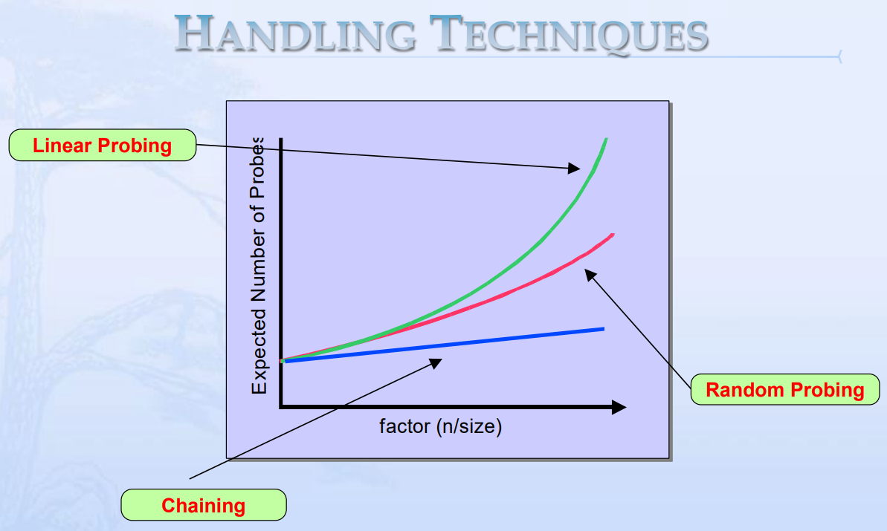

## When to Use Hash Tables

1. **Fast Lookup and Retrieval:**
   - **Dictionary Implementations:** When you need to implement a dictionary (or map) where you want to quickly retrieve a value associated with a unique key.
   - **Cache Implementations:** When implementing caches like Least Recently Used (LRU) cache to quickly check for existing cached items.
   - **Symbol Tables in Compilers:** For storing variable names and their associated information.
2. **Handling Large Datasets:**
   - **Database Indexes:** To speed up data retrieval in databases.
   - **Counting Frequencies:** When you need to count occurrences of elements efficiently, such as word frequency in a document.
3. **Removing Duplicates:**
   - **Unique Elements:** To efficiently track unique elements in a collection.
4. **Associative Arrays:**
   - **Configuration Settings:** Storing and retrieving configuration parameters where keys are setting names and values are settings.
5. **Sets:**
   - **Membership Testing:** Quickly checking if an element exists in a set.

### When Not to Use Hash Tables

1. **Order Matters:**
   - When you need to maintain the order of elements, such as in a sorted list or when you need to iterate over elements in a specific order.
2. **Small Datasets:**
   - When the overhead of managing a hash table is not justified for small amounts of data where simpler structures like arrays or linked lists may suffice.
3. **Complex Key Structures:**
   - When keys are complex objects and defining a good hash function is difficult.
4. **Range Queries:**
   - When you need to perform range queries or need elements to be sorted, as hash tables do not support efficient range queries or ordered iterations.

In summary, hash tables are ideal for scenarios where you need fast access to elements via unique keys and can tolerate some memory overhead. They are less suitable for ordered data or when operations depend on the data being in a particular sequence.

# Comparison

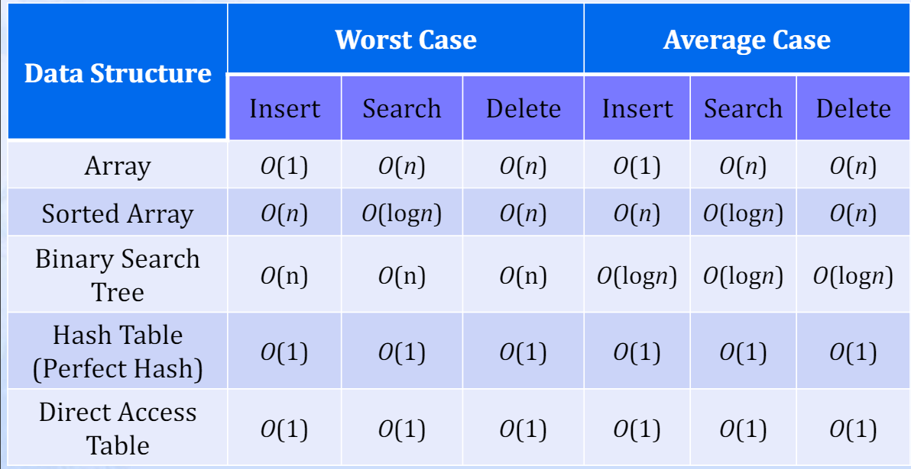

## Questions

------


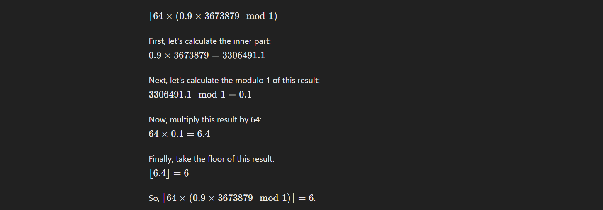

------

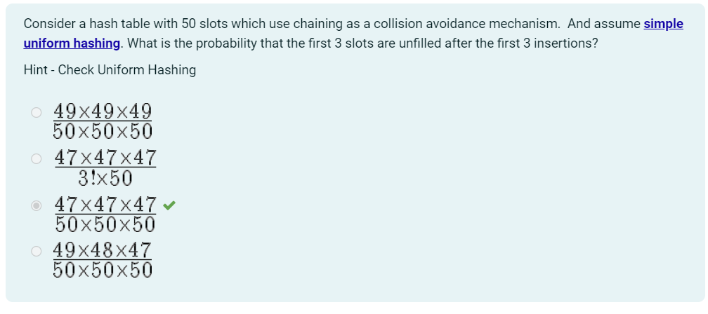

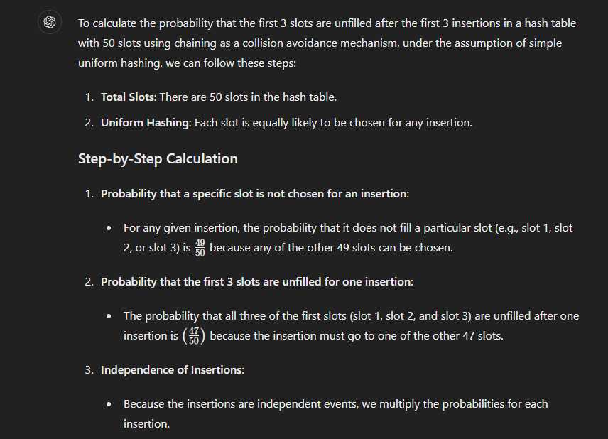

------

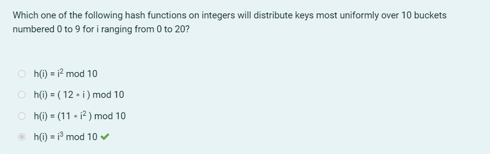

[^in here k is referred  as i and n as k]: :-

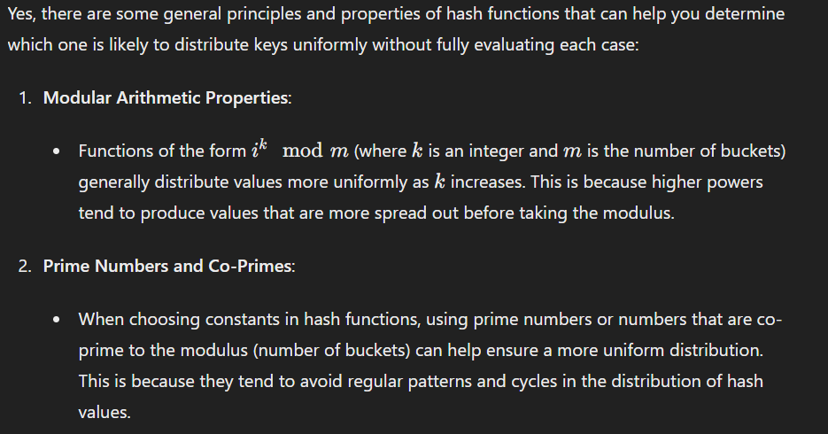
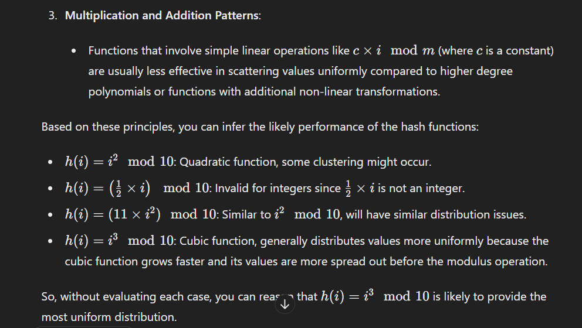

------

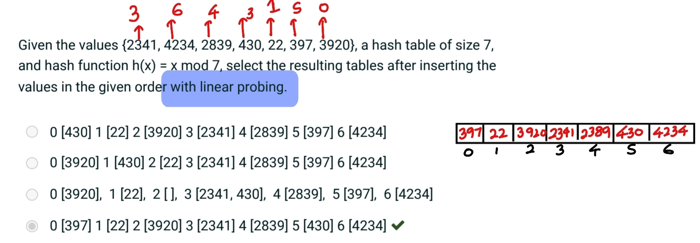

------

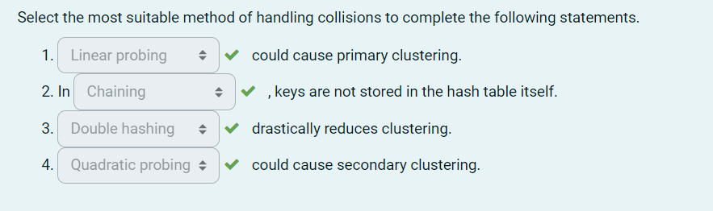
