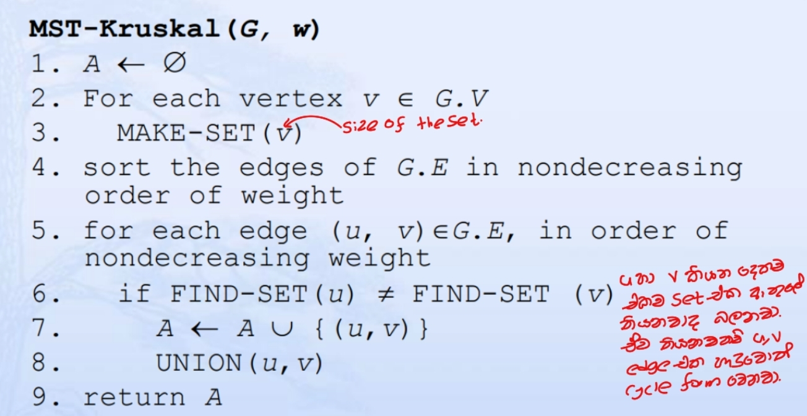
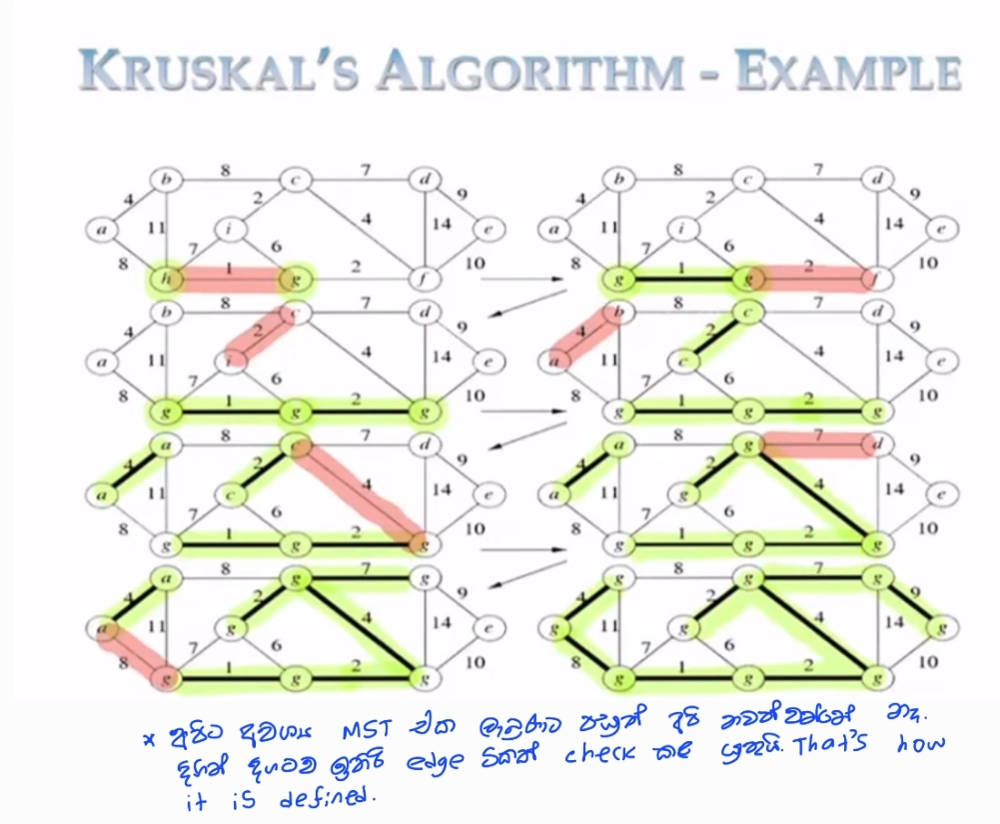
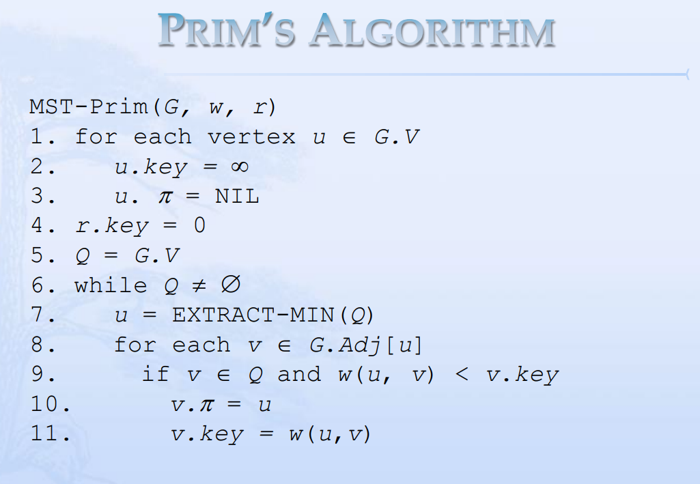
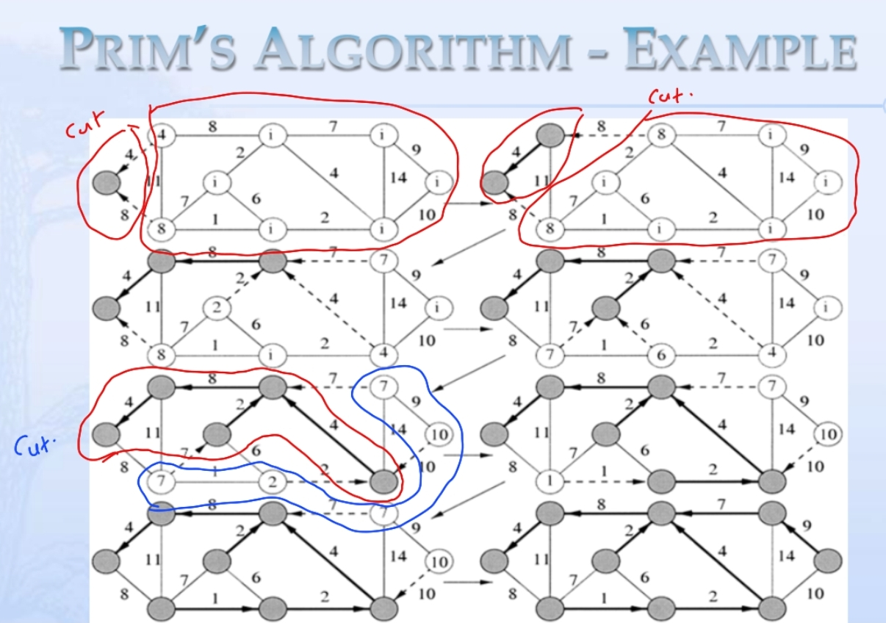
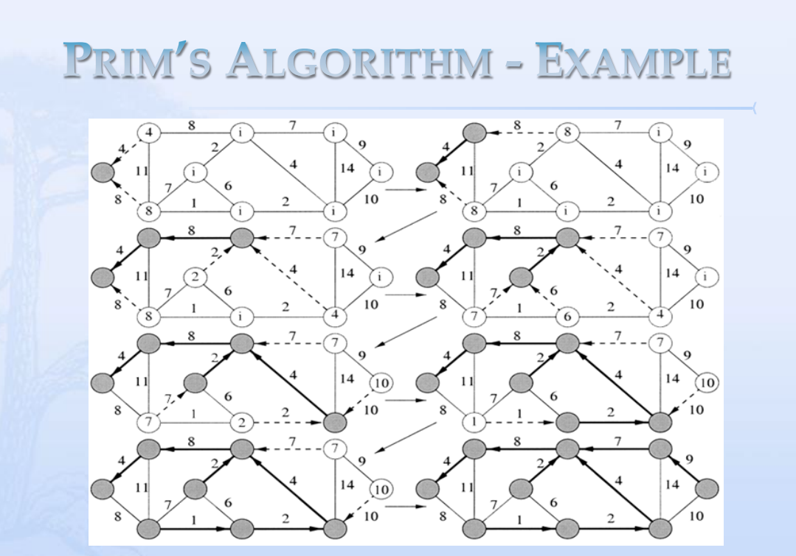
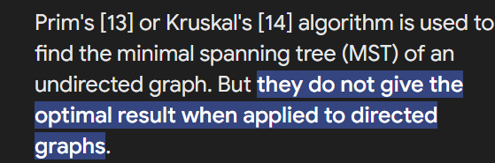

# Spanning Trees

## Definition
In graph theory, a **spanning tree** of a connected graph is a subgraph that is a tree and connects all the vertices together.

`A connected, acyclic , subgraph with all vertices`

## Properties
- **Tree Structure**: A spanning tree is a connected acyclic subgraph of the original graph.
- **Spanning Property**: It spans all the vertices of the original graph.
- **Minimum Number of Edges**: A spanning tree of a connected graph with `n`  vertices always has ` n-1 ` edges.
- **Applications**: Spanning trees have applications in network design, circuit design, routing algorithms, etc.
- **Algorithms**: Kruskal's and Prim's algorithms are commonly used to find spanning trees, including the minimum spanning tree (MST) with the minimum total edge weight.
- <mark>Spanning tree is not unique for a graph. There could be multiple spanning trees.</mark>

## Applications
- Network Design
- Circuit Design
- Routing Algorithms

## Algorithms
- Kruskal's Algorithm
- Prim's Algorithm

------

# Steiner Minimum Trees

- **Definition**: Steiner minimum trees are trees that connect specified terminal vertices in a graph while minimizing some objective function, typically total length or cost.
- **Objective**: Minimize total length or cost of the tree by adding Steiner points (additional vertices) strategically.
- **Applications**: Widely used in network design, VLSI design, telecommunications, and transportation network optimization.
- **Complexity**: Finding optimal Steiner trees is NP-hard, but approximation algorithms and heuristics exist for efficient solutions.
- **Algorithms**: Approaches include iterative improvement, branch and bound, genetic algorithms, and various approximation techniques.

Steiner trees offer powerful tools for optimizing network layouts and minimizing resource usage in diverse applications.


------

# Minimum Spanning Trees (MST)

A Minimum Spanning Tree (MST) of a <mark>weighted, undirected</mark> graph is a subset of the edges that connects all the vertices together without any cycles and with the minimum possible total edge weight.

#### Key Properties:

1. **Spanning**: It includes all the vertices of the original graph.
2. **Minimum Weight**: The sum of the weights of the edges in the MST is minimized.
3. **Acyclic**: It does not contain any cycles.
4. <mark>**Uniqueness**</mark>: If all edge weights are distinct, the MST is unique.

#### Applications:

1. **Network Design**: Designing least-cost networks, such as electrical grids, computer networks, road networks, etc. 
2. **Approximation Algorithms**: Used in algorithms for problems like the Traveling Salesman Problem (TSP).
3. **Clustering**: In hierarchical clustering, MST can be used to visualize and organize clusters.

------

# Concept of safe Edges

### Safe Edge Definition:

A **safe edge** is defined in the context of constructing the MST using algorithms like Kruskal's or Prim's. <u>An edge is considered "safe" if it can be added to the partial spanning tree being constructed without violating the conditions necessary to ensure that the tree will eventually be an MST</u>. <u>*This generally means it does not form a cycle and maintains the minimum weight property*</u>.

### Properties of Safe Edges:

> ## Cut in a Graph:
>
> A **cut** in a graph 𝐺=(𝑉,𝐸) is a partition of the vertex set 𝑉 into two disjoint subsets 𝑆 and 𝑉-S. The edges that have one endpoint in 𝑆 and the other endpoint in 𝑉-*S* are said to **cross** the cut. These edges form the cut-set of the cut.
>
> ### Cut Respects 𝐴:
>
> Given a `subset 𝐴 of edges` that form part of a growing spanning tree, we say that a cut respects 𝐴 if no edge in 𝐴 crosses the cut. In other words, all edges in 𝐴 should lie entirely within one of the two subsets formed by the cut.

1. **Cut Property**: For any cut in the graph, the minimum weight edge that crosses the cut is a safe edge. A cut is a partition of the vertices of the graph into two disjoint subsets. The edge with the smallest weight that connects a vertex in one subset to a vertex in the other subset is guaranteed to be part of the MST.

2. **Cycle Property**: For any cycle in the graph, the maximum weight edge in the cycle is not part of the MST. Removing the maximum weight edge in any cycle will help ensure that the MST is the one with the minimum total weight.

   

### Using Safe Edges in Algorithms:

1. **Kruskal's Algorithm**: This algorithm sorts all edges of the graph by their weights and processes them in ascending order. For each edge, it checks whether adding the edge to the growing MST will form a cycle. If it does not, the edge is added (safe edge); otherwise, it is discarded. This uses the concept of safe edges via the cycle property.
2. **Prim's Algorithm**: This algorithm starts with a single vertex and grows the MST one edge at a time. At each step, it adds the smallest edge that connects a vertex in the MST to a vertex outside the MST. This ensures that the edge added is always a safe edge according to the cut property.

------

### Common Algorithms:

# <u>Kruskal's Algorithm: `A greedy algo`</u>

- Sort all edges in non-decreasing order of their weight.
- Pick the smallest edge. Check if it forms a cycle with the spanning tree formed so far. If a cycle is not formed, include this edge. Else, discard it.
- Repeat until there are `𝑉−1` edges in the spanning tree.
- **Time Complexity**: `𝑂(𝐸log⁡𝐸)` due to sorting, where 𝐸 is the number of edges.




​    **Time Complexity:**` O(E * logE) or O(E * logV)` 

- Sorting of edges takes O(E * logE) time. 
- After sorting, we iterate through all edges and apply the find-union algorithm. The find and union operations can take at most O(logV) time.
- So overall complexity is O(E * logE + E * logV) time. 
- The value of E can be at most O(V^2), so O(logV) and O(logE) are the same. Therefore, the overall time complexity is O(E * logE) or O(E*logV)




#### Example:

Consider a graph with vertices {𝐴,𝐵,𝐶,𝐷}and edges with weights:

- (𝐴,𝐵) : 1
- (𝐴,𝐶) : 2
- (𝐵,𝐶) : 3
- (𝐵,𝐷) : 4                                                                                                        
- (𝐶,𝐷) : 5

```css
       A
     /   \
   1/     \2
   /       \
  B---3----C
   \       /
    \4   5/
     \   /
      \ /
       D
```

#### **Using Kruskal’s algorithm:**

1. Sort edges: (*A*,*B*), (*A*,*C*), (*B*,*C*), (*B*,*D*), (*C*,*D*).
2. Add edge (*A*,*B*).
3. Add edge (*A*,*C*).
4. Skip edge (*B*,*C*) as it forms a cycle.
5. Add edge (*B*,*D*).

The MST includes edges (*A*,*B*), (*A*,*C*), and (*B*,*D*) with a total weight of 1+2+4=7.

```css
       A
      / \
    1/   \2
    /     \
   B       C
    \
   4 \
      \
       D
```

#### Code

```c++
#include <bits/stdc++.h> 
using namespace std; 

// DSU data structure -Union finding data structure
// path compression + rank by union 
class DSU { 
	int* parent; 
	int* rank; 

public: 
	DSU(int n) 
	{ 
		parent = new int[n]; 
		rank = new int[n]; 

		for (int i = 0; i < n; i++) { 
			parent[i] = -1; 
			rank[i] = 1; 
		} 
	} 

	// Find function 
	int find(int i) 
	{ 
		if (parent[i] == -1) 
			return i; 

		return parent[i] = find(parent[i]); 
	} 

	// Union function 
	void unite(int x, int y) 
	{ 
		int s1 = find(x); 
		int s2 = find(y); 

		if (s1 != s2) { 
			if (rank[s1] < rank[s2]) { 
				parent[s1] = s2; 
			} 
			else if (rank[s1] > rank[s2]) { 
				parent[s2] = s1; 
			} 
			else { 
				parent[s2] = s1; 
				rank[s1] += 1; 
			} 
		} 
	} 
}; 

class Graph { 
	vector<vector<int> > edgelist; 
	int V; 

public: 
	Graph(int V) { this->V = V; } 

	// Function to add edge in a graph 
	void addEdge(int x, int y, int w) 
	{ 
		edgelist.push_back({ w, x, y }); 
	} 

	void kruskals_mst() 
	{ 
		// Sort all edges 
		sort(edgelist.begin(), edgelist.end()); 

		// Initialize the DSU 
		DSU s(V); 
		int ans = 0; 
		cout << "Following are the edges in the "
				"constructed MST"
			<< endl; 
		for (auto edge : edgelist) { 
			int w = edge[0]; 
			int x = edge[1]; 
			int y = edge[2]; 

			// Take this edge in MST if it does 
			// not forms a cycle 
			if (s.find(x) != s.find(y)) { 
				s.unite(x, y); 
				ans += w; 
				cout << x << " -- " << y << " == " << w 
					<< endl; 
			} 
		} 
		cout << "Minimum Cost Spanning Tree: " << ans; 
	} 
}; 

// Driver code 
int main() 
{ 
	Graph g(4); 
	g.addEdge(0, 1, 10); 
	g.addEdge(1, 3, 15); 
	g.addEdge(2, 3, 4); 
	g.addEdge(2, 0, 6); 
	g.addEdge(0, 3, 5); 

	// Function call 
	g.kruskals_mst(); 

	return 0; 
}
```

------

# <u>Prim's Algorithm: `A Greedy algo`</u>

- Start with an arbitrary node and grow the MST one edge at a time.
- At each step, add the smallest edge that connects a vertex in the MST to a vertex outside the MST.
- Use a priority queue (min-heap) to efficiently fetch the next smallest edge.
- **Time Complexity**: `𝑂(𝐸log⁡𝑉)` using a binary heap, where 𝑉 is the number of vertices.

IDEA


Pseudo Code



***\*Time Complexity:\**** `O(V^2)`, 

If the input [graph is represented using an adjacency list](https://www.geeksforgeeks.org/archives/27134), then the time complexity of Prim’s algorithm can be reduced to `O(E * logV)` with the help of a binary heap.  In this implementation, we are always considering the spanning tree to start from the root of the graph
***\*Auxiliary Space:\*`O(V)`

Example





#### Example:

Consider a graph with vertices {𝐴,𝐵,𝐶,𝐷}and edges with weights:

- (𝐴,𝐵) : 1
- (𝐴,𝐶) : 2
- (𝐵,𝐶) : 3
- (𝐵,𝐷) : 4
- (𝐶,𝐷) : 5

#### **Using prims algorithm:**

1. **Initialization**:
   - Start with an arbitrary vertex. Let’s start with vertex 𝐴.
   - Initialize the MST set with the starting vertex 𝐴.
   - Initialize a priority queue (or min-heap) to keep track of the minimum weight edge that connects a vertex inside the MST to a vertex outside the MST. Initially, the priority queue contains all edges connected to 𝐴: (𝐴,𝐵) with weight 1 and (*A*,*C*) with weight 2.
2. **Iteration**:
   - Select the edge with the minimum weight from the priority queue.
   - Add the selected edge to the MST if it connects a vertex inside the MST to a vertex outside the MST.
   - Update the priority queue with edges connected to the newly added vertex that are not yet in the MST set.

Here’s how Prim's algorithm works step-by-step for this graph:

Step-by-Step Execution:

1. Start with vertex 𝐴:
   - MST vertices: {𝐴}
   - Priority queue: [(𝐴,𝐵):1,(𝐴,𝐶):2][(*A*,*B*):1,(*A*,*C*):2]
2. **Select edge (𝐴,𝐵) with weight 1**:
   - Add edge (𝐴,𝐵) to the MST.
   - MST vertices: {𝐴,𝐵}
   - MST edges: {(𝐴,𝐵)}
   - Update the priority queue with edges connected to *B*: (𝐴,𝐶):2, (*B*,*C*):3, and (*B*,*D*):4
   - Priority queue: [(𝐴,𝐶):2, (𝐵,𝐶):3, (𝐵,𝐷):4][(*A*,*C*):2,(*B*,*C*):3,(*B*,*D*):4]
3. **Select edge (𝐴,𝐶) with weight 2**:
   - Add edge (𝐴,𝐶) to the MST.
   - MST vertices:{*A*,*B*,*C*}
   - MST edges:{(*A*,*B*),(*A*,*C*)}
   - Update the priority queue with edges connected to *C*: (*B*,*D*):4, (*C*,*D*):5 (since (*B*,*C*) connects vertices already in MST, it can be ignored)
   - Priority queue: [(𝐵,𝐷):4,(𝐶,𝐷):5][(*B*,*D*):4,(*C*,*D*):5]
4. **Select edge (𝐵,𝐷) with weight 4**:
   - Add edge (𝐵,𝐷) to the MST.
   - MST vertices: {*A*,*B*,*C*,*D*}
   - MST edges: {(𝐴,𝐵),(𝐴,𝐶),(𝐵,𝐷)}
   - No more edges to add since all vertices are now included in the MST.

Result:

The MST includes the edges (*A*,*B*), (*A*,*C*), and (*B*,*D*) with a total weight of 1+2+4=7.

This result matches the MST obtained using Kruskal’s algorithm.

#### **Code**

```c++
#include <iostream>
#include <vector>
using namespace std;

// Function to print the constructed Minimum Spanning Tree (MST)
void printMST(vector<int> parent, vector<vector<int>> graph) {
    int vertices = graph.size();
    cout << "Edge  Weight" << endl;
    // Loop through the vertices and print the edges of the MST
    for (int i = 1; i < vertices; i++) {
        cout << parent[i] << " - " << i << "    " << graph[i][parent[i]] << endl;
    }
}

// Function to find the vertex with the minimum key value that is not yet included in the MST
int minKey(vector<int> key, vector<bool> mstSet, int V) {
    int min = INT_MAX;
    int min_index;
    // Loop through all vertices to find the minimum key value
    for (int v = 0; v < V; v++) {
        if (!mstSet[v] && key[v] < min) { // If the vertex is not yet included in the MST and its key value is the minimum
            min = key[v];
            min_index = v;
        }
    }
    return min_index;
}

// Function to construct and print the MST using Prim's algorithm
void primsMST(vector<vector<int>> graph, int V) {
    vector<int> parent(V); // Vector to store the constructed MST
    vector<int> key(V, INT_MAX); // Key values used to pick the minimum weight edge in the cut
    vector<bool> mstSet(V, false); // To represent the set of vertices included in the MST

    key[0] = 0; // Make key 0 for the source vertex so that it is picked first
    parent[0] = -1; // The root node does not have any parent

    // The MST will have V vertices
    for (int iteration = 0; iteration < V - 1; iteration++) {
        // Pick the minimum key vertex from the set of vertices not yet included in the MST
        int u = minKey(key, mstSet, V);
        mstSet[u] = true; // Add the picked vertex to the MST set

        // Update the key and parent index of the adjacent vertices of the picked vertex
        for (int v = 0; v < V; v++) {
            // graph[u][v] is non-zero only for adjacent vertices of u
            // mstSet[v] is false for vertices not yet included in the MST
            // Update the key only if graph[u][v] is smaller than key[v]
            if (graph[u][v] && !mstSet[v] && graph[u][v] < key[v]) {
                parent[v] = u;
                key[v] = graph[u][v];
            }
        }
    }
    // Print the constructed MST
    printMST(parent, graph);
}

int main() {
    int V = 5; // Number of vertices in the graph
    // Representation of the graph using an adjacency matrix
    vector<vector<int>> graph = {
        {0, 2, 0, 6, 0},
        {2, 0, 3, 8, 5},
        {0, 3, 0, 0, 7},
        {6, 8, 0, 0, 9},
        {0, 5, 7, 9, 0},
    };

    // Function call to construct and print the MST using Prim's algorithm
    primsMST(graph, V);
    return 0;
}
```

Using a priority Queue

```c++
#include <iostream>
#include <vector>
#include <queue>
#include <utility>

using namespace std;

// Function to print the constructed Minimum Spanning Tree (MST)
void printMST(vector<int> parent, vector<vector<int>> graph) {
    int vertices = graph.size();
    cout << "Edge  Weight" << endl;
    for (int i = 1; i < vertices; i++) {
        cout << parent[i] << " - " << i << "    " << graph[i][parent[i]] << endl;
    }
}

// Function to construct and print the MST using Prim's algorithm with a priority queue
void primsMST(vector<vector<int>> graph, int V) {
    vector<int> parent(V); // Vector to store the constructed MST
    vector<int> key(V, INT_MAX); // Key values used to pick the minimum weight edge in the cut
    vector<bool> mstSet(V, false); // To represent the set of vertices included in the MST

    priority_queue<pair<int, int>, vector<pair<int, int>>, greater<pair<int, int>>> pq; // Min-heap priority queue

    key[0] = 0; // Make key 0 for the source vertex so that it is picked first
    pq.push({0, 0}); // Insert source vertex with key 0
    parent[0] = -1; // The root node does not have any parent

    while (!pq.empty()) {
        int u = pq.top().second; // Extract the vertex with the minimum key value
        pq.pop();

        if (mstSet[u]) continue; // If the vertex is already included in the MST, skip it

        mstSet[u] = true; // Add the picked vertex to the MST set

        // Update the key and parent index of the adjacent vertices of the picked vertex
        for (int v = 0; v < V; v++) {
            if (graph[u][v] && !mstSet[v] && graph[u][v] < key[v]) {
                key[v] = graph[u][v];
                pq.push({key[v], v});
                parent[v] = u;
            }
        }
    }

    // Print the constructed MST
    printMST(parent, graph);
}

int main() {
    int V = 5; // Number of vertices in the graph
    vector<vector<int>> graph = {
        {0, 2, 0, 6, 0},
        {2, 0, 3, 8, 5},
        {0, 3, 0, 0, 7},
        {6, 8, 0, 0, 9},
        {0, 5, 7, 9, 0},
    };

    // Function call to construct and print the MST using Prim's algorithm
    primsMST(graph, V);
    return 0;
}
```


------


| Kruskal’s Algorithm                                          | Prim’s Algorithm                                             |
| :----------------------------------------------------------- | :----------------------------------------------------------- |
| It starts to build the Minimum Spanning Tree from the vertex carrying minimum weight in the graph.(By edges) | It starts to build the Minimum Spanning Tree from any vertex in the graph.(By vertices) |
| It traverses one node only once.                             | It traverses one node more than one time to get the minimum distance. |
| Kruskal’s algorithm’s time complexity is `O(E log V) or O(E log E) `, `V` being the number of vertices. `E`is the number of edges. | Prim’s algorithm has a time complexity of `O(V^2)`,             `V` being the number of vertices and can be improved up to `O(E log V)` using Fibonacci heaps. |
| Kruskal’s algorithm can generate forest(disconnected components) at any instant as well as it can work on disconnected components | Prim’s algorithm gives connected component as well as it works only on connected graph. |
| Kruskal’s algorithm runs faster in sparse graphs.            | Prim’s algorithm runs faster in dense graphs.                |
| It generates the minimum spanning tree starting from the least weighted edge. | It generates the minimum spanning tree starting from the root vertex. |
| Applications of Kruskal algorithm are LAN connection, TV Network etc. | Applications of prim’s algorithm are Travelling Salesman Problem, Network for roads and Rail tracks connecting all the cities etc. |
| Kruskal’s algorithm prefer heap data structures.             | Prim’s algorithm prefer list data structures.                |

# Conclusion

The Minimum Spanning Tree is a foundational concept in graph theory with diverse practical applications, from designing efficient networks to clustering data. Understanding and implementing MST algorithms like Kruskal’s and Prim’s are essential skills in computer science and optimization fields.

------

# Special points

- Spanning tree is not unique for a graph. There could be multiple spanning trees. This is true for minimum spanning trees as well. But if weights are unique there is only one MST.
- <u>If a given weighted graph is a tree , the MST for the graph is the graph itself .</u>  


 a `complete graph` is a type of graph in which every pair of distinct vertices is connected by a unique edge. This means that there are no isolated vertices, and each vertex is directly connected to every other vertex.

- 


