# Single Source Shortest Path

The single-source shortest path problem involves finding the shortest paths from a given source vertex to all other vertices in a weighted graph. There are several algorithms to solve this problem, depending on the nature of the graph (e.g., whether it has negative weights or is dense/sparse). Here are some of the most common algorithms:

# 1. Dijkstra's Algorithm

- **Description**: This algorithm is used for graphs with non-negative weights.
- **Time Complexity**: `O(V^2)` without a priority queue, where V is the number of vertices.
  - with priority queue  `O(E * LogV)` . IT IS RECOMMENDED TO ALWAYS USE PRIORITY QUEUE FOR DIJKSTRA'S

- **`Dijkstra’s Algorithms fails for the Graphs having Negative Edges`**
  - The problem with negative weights arises from the fact that Dijkstra’s algorithm assumes that once a node is added to the set of visited nodes, its distance is finalized and will not change. However, in the presence of negative weights, this assumption can lead to incorrect results. 
  - 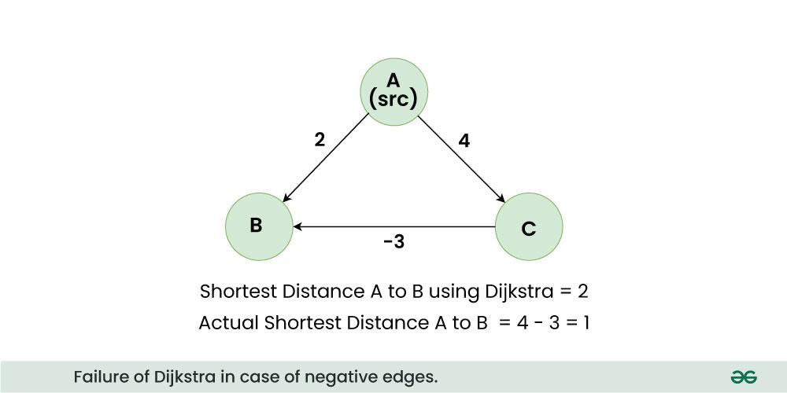             
  - In the above graph, A is the source node, among the edges A to B and A to C, A to B is the smaller weight and Dijkstra assigns the shortest distance of B as 2, but because of existence of a negative edge from C to B, the actual shortest distance reduces to 1 which Dijkstra fails to detect.              

- Steps:
  1. Initialize distances from the source to all vertices as infinity, and the distance to the source itself as 0.
  2. Mark all vertices as unvisited.
  3. For the set of vertices not yet processed, select the vertex with the smallest distance.
  4. Update the distances of its adjacent vertices.
  5. Mark the current vertex as visited.
  6. Repeat steps 3-5 until all vertices are processed.

To understand the Dijkstra’s Algorithm lets take a graph and find the shortest path from source to all nodes.

Consider below graph and ***\*src = 0\****


**Step 1:**

- The visited list is false for all items and distances assigned to vertices are {0, INF, INF, INF, INF, INF, INF, INF} where INF indicates infinite. 
- Now pick the vertex with a minimum distance value. The vertex 0 is picked,mark vertex 0 as visited, update distance values of its adjacent vertices. 
- Adjacent vertices of 0 are 1 and 7. The distance values of 1 and 7 are updated as 4 and 8. 

The following subgraph shows vertices and their distance values, only the vertices with finite distance values are shown. The `vertices marked as visited are shown in `green color.

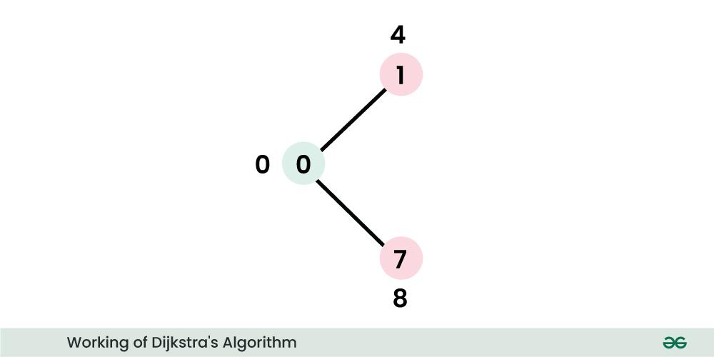

**Step 2:**

- Pick the vertex with minimum distance value and not already visited. The vertex 1 is picked and marked as visited. 
- Update the distance values of adjacent vertices of 1. 
- The distance value of vertex 2 becomes 12.
  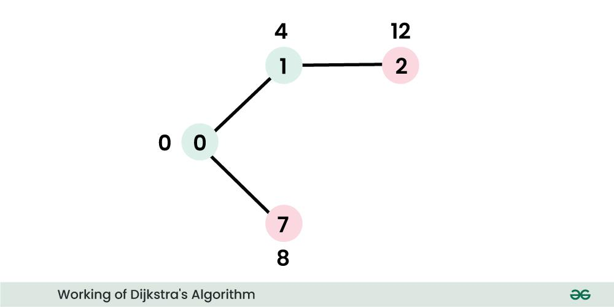

**Step 3:**

- Pick the vertex with minimum distance value and not already visited. Vertex 7 is picked. mark 7 as visited.
- Update the distance values of adjacent vertices of 7. The distance value of vertex 6 and 8 becomes finite (15 and 9 respectively). 
  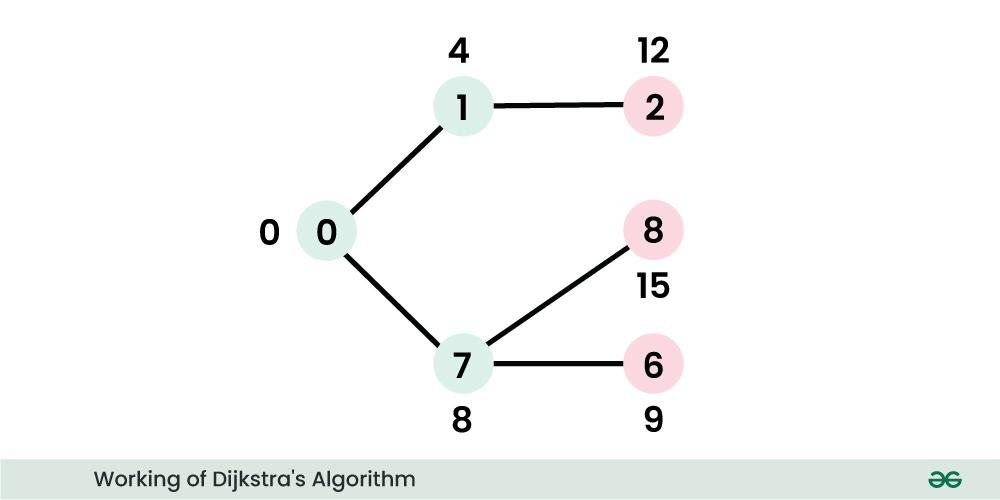

**Step 4:**

- Pick the vertex with minimum distance value and not visited. Vertex 6 is picked. mark 6 as visited.
- Update the distance values of adjacent vertices of 6. The distance value of vertex 5 and 8 are updated.
  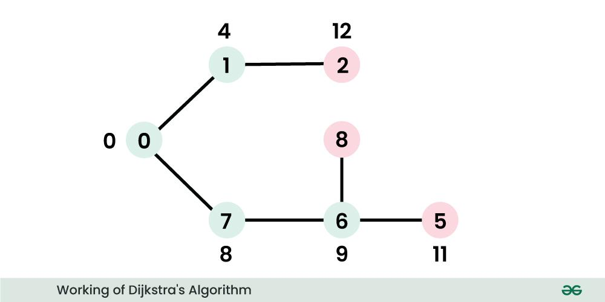


- We repeat the above steps until all vertices are visited. Finally, we get the following Shortest Path Tree (SPT).

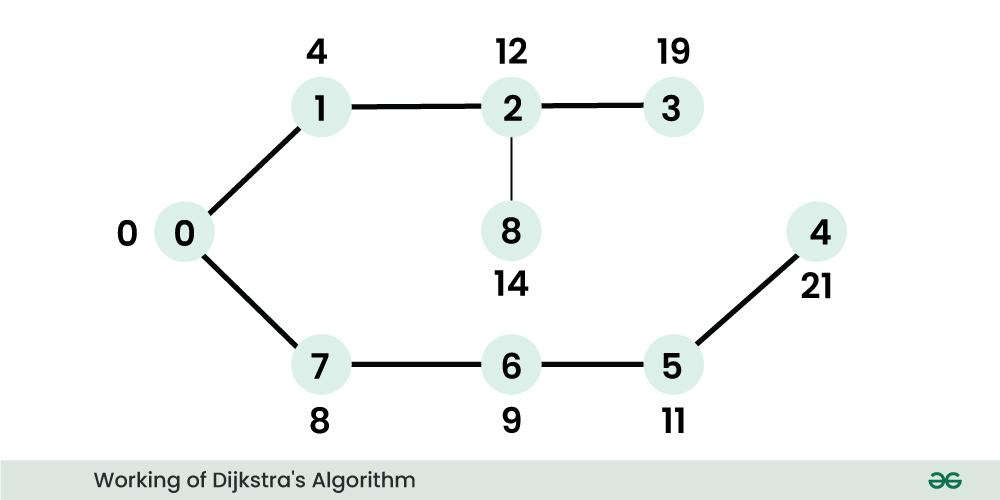


### Code for Dijkstra's algorithm

```c++
// C++ program for Dijkstra's single source the shortest path algorithm. The program is for //adjacency matrix representation of the graph
#include <iostream>
using namespace std;
#include <climits>
#include <vector>

// Number of vertices in the graph
#define V 9

// A utility function to find the vertex with minimum distance value, from the set of vertices not //yet included in the shortest path tree
int minDistance(vector<int> dist, vector<bool> visited)
{
    // Initialize min value
	int min = INT_MAX;
    int min_index;

	for (int v = 0; v < V; v++)
		if (!visited[v] && dist[v] < min) {
            min = dist[v];
            min_index = v;
        }
	return min_index;
}

// A utility function to print the constructed distance array
void printSolution(vector<int> dist)
{
	cout << "Vertex \t Distance from Source" << endl;
	for (int i = 0; i < V; i++)
		cout << i << " \t\t\t\t" << dist[i] << endl;
}

// Function that implements Dijkstra's single source the shortest path algorithm for a graph represented using  adjacency matrix representation
void dijkstra(int graph[V][V], int src)
{
    vector<int> dist(V,INT_MAX);// The output array. dist[i] will hold the shortest distance from src to i
    vector<bool> visited(V, false); // visited[i] will be true if vertex i is included in the shortest path tree or shortest distance from src to i is finalized

    // Distance of source vertex from itself is always 0
	dist[src] = 0;

	// Find the shortest path for all vertices
	for (int count = 0; count < V -1; count++) {
		// Pick the minimum distance vertex from the set of vertices not yet visited. u is always equal to src in the first iteration.
		int u = minDistance(dist, visited);

		// Mark the picked vertex as processed
		visited[u] = true;

		// Update dist value of the adjacent vertices of the picked vertex.
		for (int v = 0; v < V; v++)

			// Update dist[v] only if is not in visited,there is an edge from u to v, and total weight of path from src to v through u is smaller than current value of dist[v]
			if (!visited[v] && graph[u][v]  &&  dist[u] + graph[u][v] < dist[v]) 
				dist[v] = dist[u] + graph[u][v];
	}

	// print the constructed distance array
	printSolution(dist);
}

// driver's code
int main()
{

	/* Let us create the example graph discussed above */
	int graph[V][V] = { { 0, 4, 0, 0, 0, 0, 0, 8, 0 },
						{ 4, 0, 8, 0, 0, 0, 0, 11, 0 },
						{ 0, 8, 0, 7, 0, 4, 0, 0, 2 },
						{ 0, 0, 7, 0, 9, 14, 0, 0, 0 },
						{ 0, 0, 0, 9, 0, 10, 0, 0, 0 },
						{ 0, 0, 4, 14, 10, 0, 2, 0, 0 },
						{ 0, 0, 0, 0, 0, 2, 0, 1, 6 },
						{ 8, 11, 0, 0, 0, 0, 1, 0, 7 },
						{ 0, 0, 2, 0, 0, 0, 6, 7, 0 } };

	// Function call
	dijkstra(graph, 0);

	return 0;
}
```

------

# 2. Bellman-Ford Algorithm

- **Description**: This algorithm works with graphs that may have negative weights and can detect negative cycles.

- **Time Complexity**: `O(V*E)`
  - Time Complexity when graph is connected:
    - Best Case: O(E), when distance array after 1st and 2nd relaxation are same , we can simply stop further processing
    - Average Case: O(V*E)
    - Worst Case: O(V*E)
  - Time Complexity when graph is disconnected:
    - All the cases: O(E*(V^2))
  - Auxiliary Space: O(V), where V is the number of vertices in the graph.
  
- Auxiliary Space:= O(V)

- `Bellman-Ford can handle negative weight edges. But if the graph contains a negative cycle (A negative cycle is a cycle in a graph where the sum of the edge weights in the cycle is less than zero.)it will detect negative cycles to prevent infinite reductions in path length.`

- #### Steps:
  
  1. Initialize distances from the source to all vertices as infinity, and the distance to the source itself as 0.
  
  2. Relax all edges V−1 times (where V is the number of vertices).
  
     - Relaxation Step
  
  
  
  ```js
   1.	For a given edge ((u, v) with weight w(u, v), check if the current known shortest  	  		distance to (v), (`distance[v]`) can be improved by taking the edge from (u) to (v).This is 	done by comparing `distance[u] + w(u, v)` with `distance[v]`.
   2. If `distance[u] + w(u, v) < distance[v]`, update `distance[v]` to `distance[u] + w(u, v)`.
   3. Update the predecessor of \(v\) to \(u\) to keep track of the path.	
  ```
  
  3. Check for negative weight cycles by performing one more relaxation step. If any distance is updated, then a negative cycle exists.

> ### HOW RELAXING EVERY EDGE V-1 TIMES GIVES US SINGLE SOURCE SHORTEST PATH?
>
> In the worst-case scenario, a shortest path between two vertices can have at most V−1 edges, where N is the number of vertices. This is because a simple path in a graph with N vertices can have at most V−1 edges.
>
> The Bellman-Ford algorithm relaxes edges V−1 times to ensure all shortest path estimates are optimal, assuming no negative-weight cycles. If a negative-weight cycle is reachable from the source, the algorithm will detect it after V−1 iterations, as the negative cycle disrupts the shortest path lengths.
>
> In summary, relaxing edges V−1 times in the Bellman-Ford algorithm guarantees the shortest paths are correctly calculated, provided there are no negative-weight cycles.

Example:

Let’s suppose we have a graph which is given below and we want to find whether there exists a negative cycle or not using Bellman-Ford.

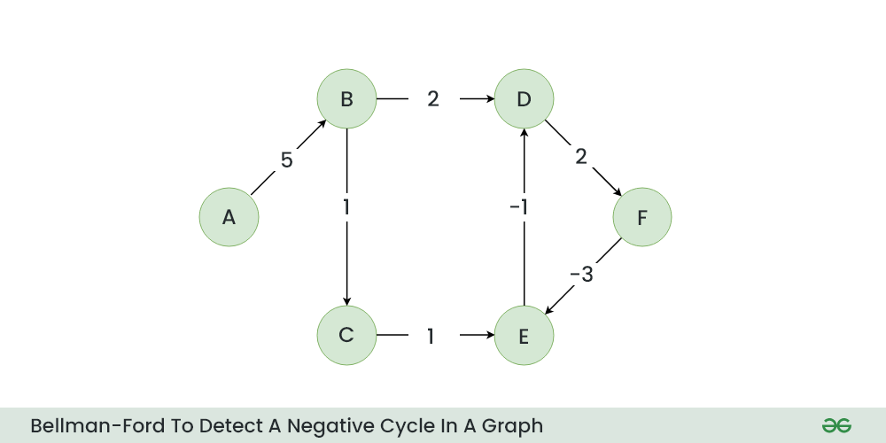

​											**Initial Graph**

**Step 1:** Initialize a distance array Dist[] to store the shortest distance for each vertex from the source vertex. Initially distance of source will be 0 and Distance of other vertices will be INFINITY.

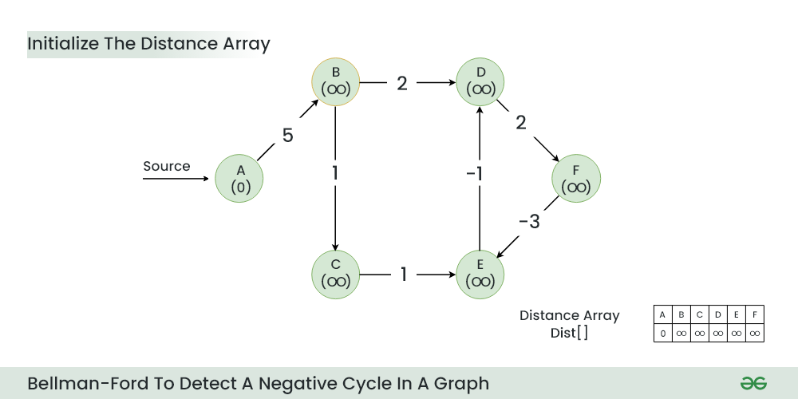

​									    **Initialize a distance array**

**Step 2:** Start relaxing the edges, during 1st Relaxation:

- Current Distance of B > (Distance of A) + (Weight of A to B) i.e. Infinity > 0 + 5
  - Therefore, Dist [B] = 5

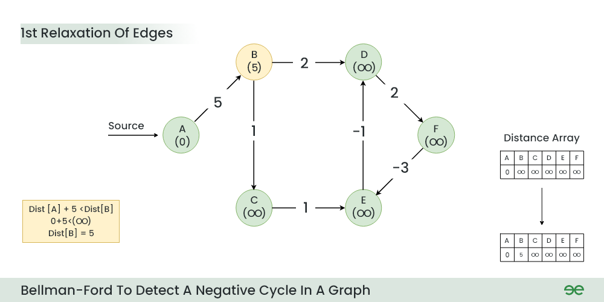

​											**1st Relaxation**

**Step 3:** *During 2nd Relaxation:*

- Current Distance of D > (Distance of B) + (Weight of B to D) i.e. Infinity > 5 + 2
  - Dist[D] = 7
- Current Distance of C > (Distance of B) + (Weight of B to C) i.e. Infinity > 5 + 1
  - Dist[C] = 6

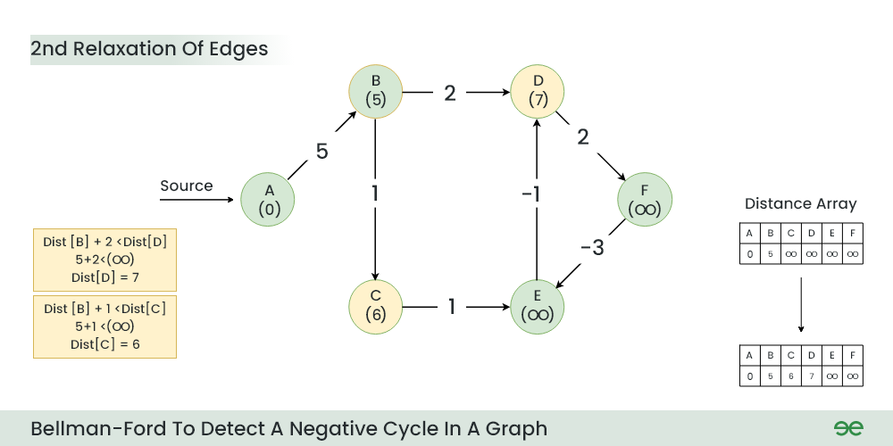

​											**2nd Relaxation**

**Step 4:**  During 3rd Relaxation:

- Current Distance of F > (Distance of D ) + (Weight of D to F) i.e. Infinity > 7 + 2
  - Dist[F] = 9
- Current Distance of E > (Distance of C ) + (Weight of C to E) i.e. Infinity > 6 + 1
  - Dist[E] = 7

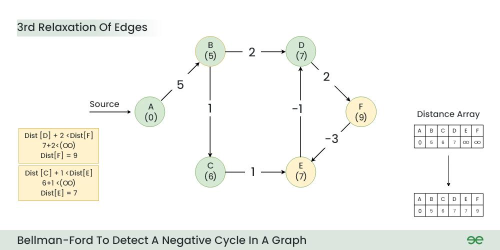

​											**3rd Relaxation**

**Step 5:** During 4th Relaxation:

- Current Distance of D > (Distance of E) + (Weight of E to D) i.e. 7 > 7 + (-1)
  - Dist[D] = 6
- Current Distance of E > (Distance of F ) + (Weight of F to E) i.e. 7 > 9 + (-3)
  - Dist[E] = 6

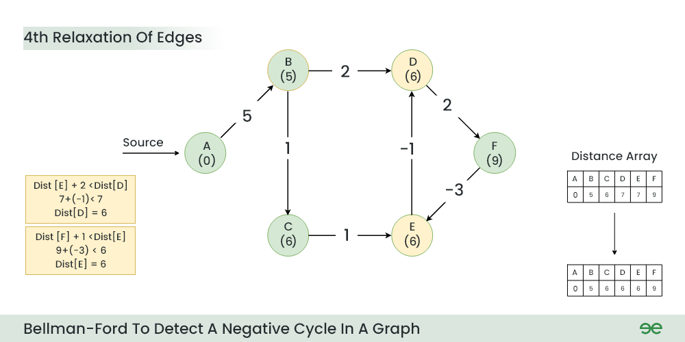

​										**4th Relaxation**

**Step 6:** During 5th Relaxation:

- Current Distance of F > (Distance of D) + (Weight of D to F) i.e. 9 > 6 + 2
  - Dist[F] = 8
- Current Distance of D > (Distance of E ) + (Weight of E to D) i.e. 6 > 6 + (-1)
  - Dist[D] = 5
- Since the graph h 6 vertices, So during the 5th relaxation the shortest distance for all the vertices should have been calculated.

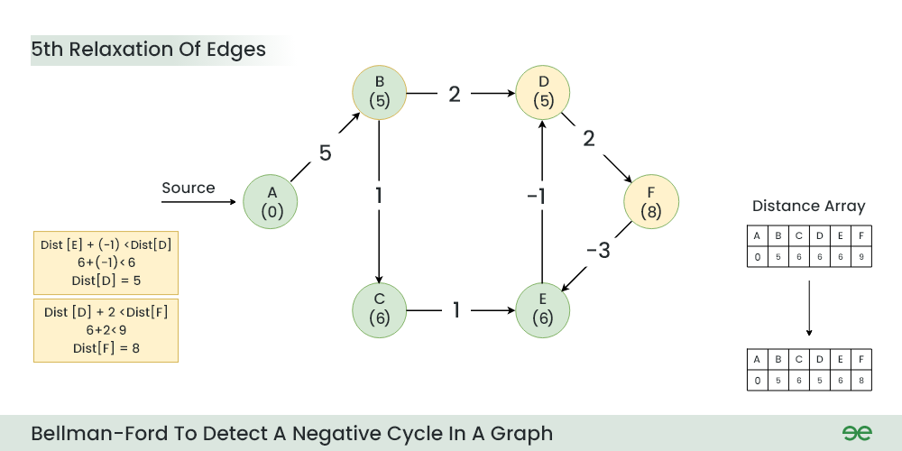

​											**5th Relaxation**

**Step 7:** Now the final relaxation i.e. the 6th relaxation should indicate the presence of negative cycle if there is any changes in the distance array of 5th relaxation.

During the 6th relaxation, following changes can be seen:

- Current Distance of E > (Distance of F) + (Weight of F to E) i.e. 6 > 8 + (-3)
  - Dist[E]=5
- Current Distance of F > (Distance of D ) + (Weight of D to F) i.e. 8 > 5 + 2
  - Dist[F]=7

Since, we observer changes in the Distance array Hence ,we can conclude the presence of a negative cycle in the graph.


​											**6th Relaxation**

Result: A negative cycle (D->F->E) exists in the graph.

## Code For Bellman-Ford Algorithm

```c++
#include <iostream>
#include <vector>
#include <limits.h>

using namespace std;

// A structure to represent a weighted edge in the graph
struct Edge {
    int src, dest, weight;
};

// A class to represent a graph
class Graph {
public:
    int V, E; // V is the number of vertices and E is the number of edges
    vector<Edge> edges; // vector to store all edges

    Graph(int V, int E);
    void addEdge(int u, int v, int w);
    void bellmanFord(int src);
};

// Constructor to initialize the graph
Graph::Graph(int V, int E) {
    this->V = V;
    this->E = E;
}

// Function to add an edge to the graph
void Graph::addEdge(int u, int v, int w) {
    Edge edge = {u, v, w};
    edges.push_back(edge);
}

// Function to execute the Bellman-Ford algorithm
void Graph::bellmanFord(int src) {
    // Step 1: Initialize distances from src to all other vertices as INFINITE
    vector<int> dist(V, INT_MAX);
    dist[src] = 0;

    // Step 2: Relax all edges |V| - 1 times
    for (int i = 1; i <= V - 1; i++) {
        for (int j = 0; j < E; j++) {
            int u = edges[j].src;
            int v = edges[j].dest;
            int weight = edges[j].weight;
            if (dist[u] != INT_MAX && dist[u] + weight < dist[v])
                dist[v] = dist[u] + weight;
        }
    }

    // Step 3: Check for negative-weight cycles
    for (int j = 0; j < E; j++) {
        int u = edges[j].src;
        int v = edges[j].dest;
        int weight = edges[j].weight;
        if (dist[u] != INT_MAX && dist[u] + weight < dist[v]) {
            cout << "Graph contains negative weight cycle" << endl;
            return;
        }
    }

    // Print all distances
    cout << "Vertex Distance from Source" << endl;
    for (int i = 0; i < V; i++)
        cout << i << "\t\t" << dist[i] << endl;
}

int main() {
    int V = 5; // Number of vertices in graph
    int E = 8; // Number of edges in graph
    Graph g(V, E);

    // add edges to the graph
    g.addEdge(0, 1, -1);
    g.addEdge(0, 2, 4);
    g.addEdge(1, 2, 3);
    g.addEdge(1, 3, 2);
    g.addEdge(1, 4, 2);
    g.addEdge(3, 2, 5);
    g.addEdge(3, 1, 1);
    g.addEdge(4, 3, -3);

    // Run Bellman-Ford algorithm from vertex 0
    g.bellmanFord(0);

    return 0;
}
```

###  Comparison Summary

| Feature                  | Dijkstra's Algorithm                                         | Bellman-Ford Algorithm                        |
| ------------------------ | ------------------------------------------------------------ | --------------------------------------------- |
| Time Complexity          | O(V^2) in normal method.                                                                 O ((V + E) \ log V)  with min-heap. | \(O(VE)\)                                     |
| Space Complexity         | \(O(V)\)                                                     | \(O(V)\)                                      |
| Handles Negative Weights | No                                                           | Yes                                           |
| Negative Weight Cycles   | Cannot detect                                                | Can detect                                    |
| Graph Type               | Non-negative weights                                         | Any (including negative weights)              |
| Approach                 | `Greedy`                                                     | `Dynamic Programming`                         |
| Use Case                 | Real-time systems, dense graphs                              | Graphs with negative weights, cycle detection |

------

# Questions

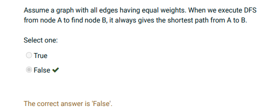

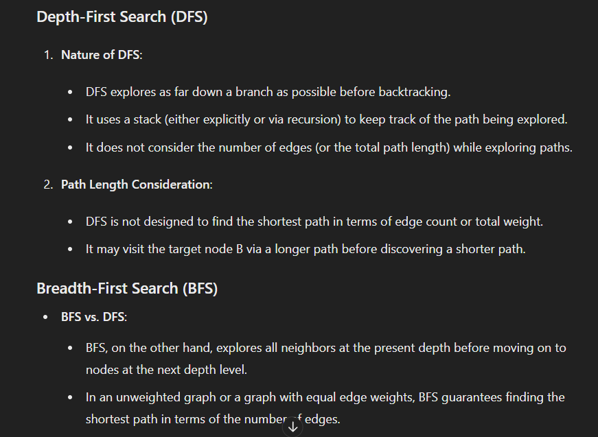

------

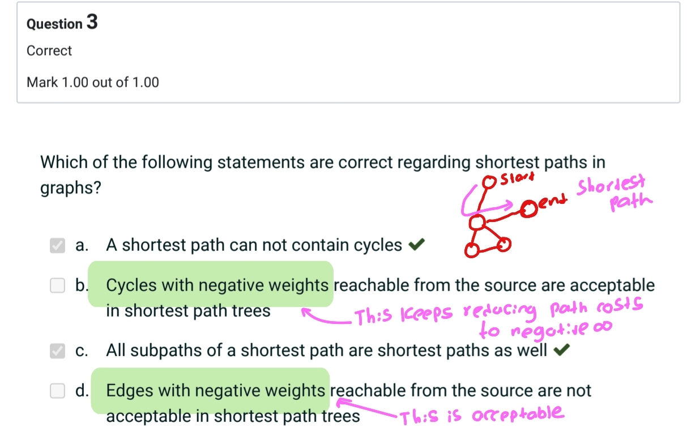

------

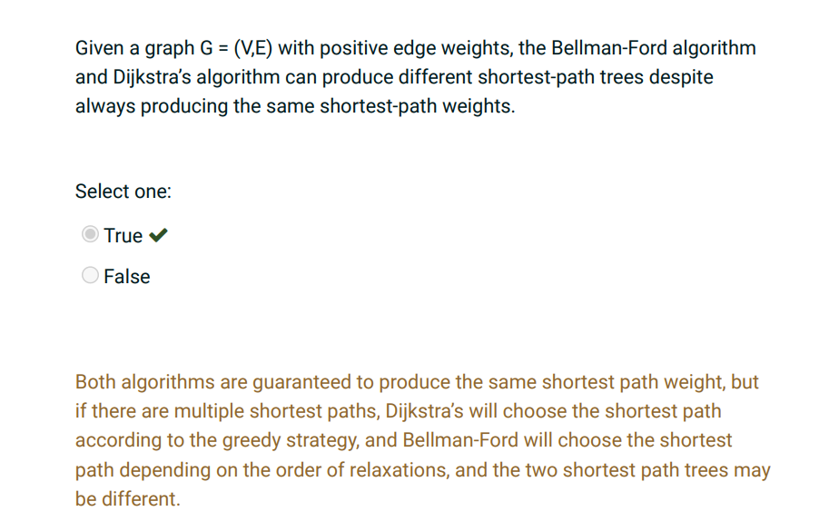

------

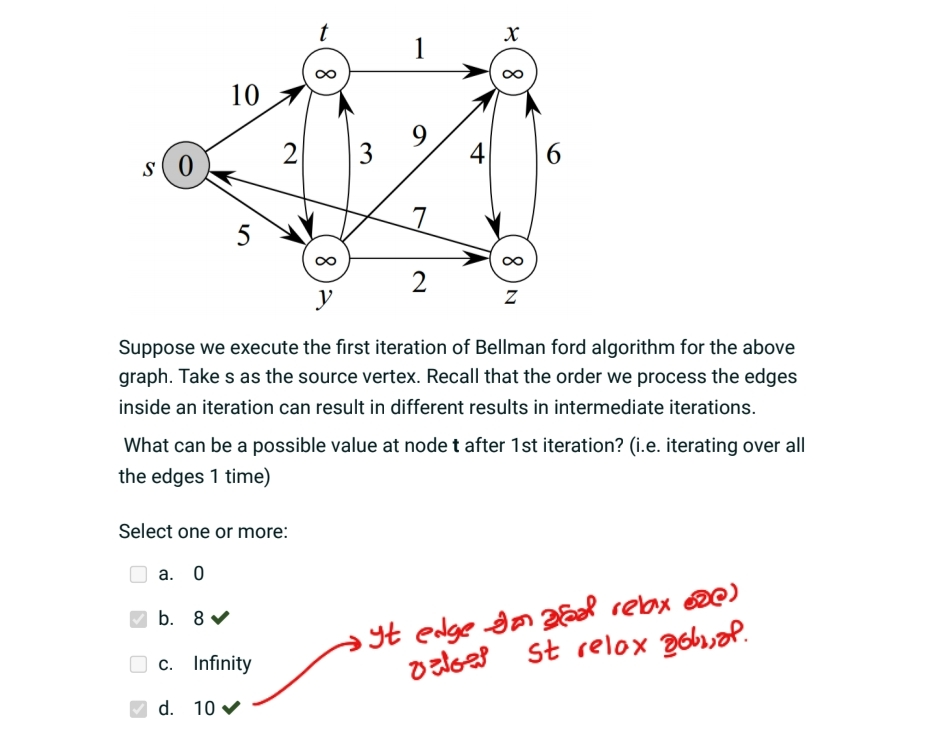